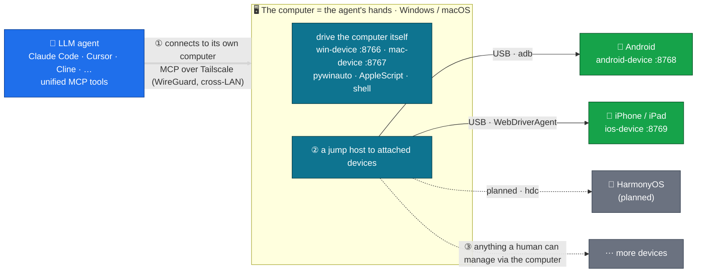

# agent-fleet

[](LICENSE)
[](https://github.com/metahub-tech/agent-fleet/releases/tag/v0.8.2-alpha)

[English](README.md) · [简体中文](README.zh-CN.md) · [日本語](README.ja.md) · [한국어](README.ko.md) · [Español](README.es.md) · [Français](README.fr.md) · **Deutsch** · [Português (BR)](README.pt-BR.md) · [Русский](README.ru.md)

<p align="center">
  
  <br><sub><em>Ein LLM-Agent steuert ein echtes iPad über MCP — ganz ohne Hände.</em></sub>
</p>

> **Gib deinem LLM-Agenten seine eigene Flotte physischer Geräte.**
> Verbinde echte Windows- / macOS- / Android- / iOS-Hardware über MCP mit deinem LLM-Agenten, damit er sie wie ein Mensch bedient. Installation mit einem einzigen Befehl:
>
> ```bash
> uvx --from "git+https://github.com/metahub-tech/agent-fleet@v0.8.2-alpha#subdirectory=cli" agent-fleet setup
> ```

## Was ist das

Binde **echte Geräte** — Windows-PCs, Macs, Android-Phones, iPhones — in die Toolchain deines LLM-Agenten ein, damit er sie wie lokale Befehle steuert: Screenshots machen, Buttons antippen, Tests ausführen, Logs lesen, GUIs debuggen.

Das ist Infrastruktur für **agentengetriebenes Software-Testing und plattformübergreifende Verifikation** — und im weiteren Sinne eine Grundlage, um Agenten echte Wahrnehmung und Wirkmacht in der physischen Welt zu geben.

```
┌─────────────────┐                              ┌──────────────┐
│  Agent (any OS) │ ──── Tailscale Mesh ─────>  │ Windows PC   │ win-device     :8766 ✅
│  Claude Code /  │                              ├──────────────┤
│  Cursor / Cline │                              │ macOS box    │ mac-device     :8767 ✅
│  / OpenClaw /   │                              ├──────────────┤
│  Antigravity /  │                              │ Android phone│ android-device :8768 ✅
│  Hermes / ...   │                              ├──────────────┤
└─────────────────┘                              │ iPhone/iPad  │ ios-device     :8769 ✅
                                                 └──────────────┘
            ↑                                                ↑
   uvx agent-fleet setup           generates configs for 6 agent frameworks
   one command: install client + server / configure Tailscale / guide permissions / self-check / emit snippets
```

## Status

| Komponente | Version | Status |
|---|---|---|
| Windows-10/11-Brücke | `0.2.0` | ✅ Veröffentlicht (win-device, 40 Tools, streamable-http) |
| macOS-12+-Brücke | `0.3.0` | ✅ Veröffentlicht (mac-device, launchd, 41 Tools, GUI-Berechtigungsflow) |
| Android-Brücke | `0.7.0-alpha` | ✅ Veröffentlicht (android-device, **25 Tools**, Multi-Device + USB + drahtlos + Hybrid-ADB) |
| agent-fleet-CLI-Assistent | `0.5.0-alpha` | ✅ Veröffentlicht (`uvx agent-fleet setup` One-Shot-Installation; Configs für 6 Frameworks) |
| Rollen-Umbenennung → `<os>-device` + macOS-Berechtigungs-Guide | `0.6.0-alpha` | ✅ Veröffentlicht |
| v0.6.x-Patches (UI-Introspektion, Smoke-Tests, Bugfixes, Installer-Härtung…) | `0.6.1–0.6.15` | ✅ Veröffentlicht — siehe [CHANGELOG.md](CHANGELOG.md) |
| iOS-/iPadOS-Brücke | `0.8.0-alpha` | ✅ Veröffentlicht (ios-device, 26 Tools, WebDriverAgent + pymobiledevice3, iPad verifiziert) |
| iOS-WDA-Daemon (Boot-Autostart + Keep-Alive) | `0.8.2-alpha` | ✅ Veröffentlicht (go-ios runwda + tunneld launchd; kostenlose/kostenpflichtige Signiermodi) |
| Geräteübergreifende Koordination | `0.10.0` | 🔭 Zukünftig |
| Öffentliches Stable-Release | `1.0.0` | 🔭 Zukünftig (nach Community-Feedback zur Alpha) |

Siehe [`docs/roadmap.md`](docs/roadmap.md).

## Schnellstart

**Einsteiger / One-Shot-Ablauf** — auf dem zu steuernden Gerät (ein PC oder ein PC mit angeschlossenen Phones):

```bash
# macOS / Linux  —  NOT `curl ... | bash`!  The wizard is interactive and bash
# piped from curl uses stdin for the script itself, so questionary's prompts
# die with EOFError.  The `bash -c "$(...)"` form puts the script in argv and
# leaves stdin = terminal.
bash -c "$(curl -fsSL https://raw.githubusercontent.com/metahub-tech/agent-fleet/main/install.sh)"

# Windows  —  `irm | iex` is fine on PowerShell because iex runs the script in
# the current session and Read-Host reads from the console host, not stdin.
powershell -ExecutionPolicy Bypass -c "irm https://raw.githubusercontent.com/metahub-tech/agent-fleet/main/install.ps1 | iex"
```

Oder, falls du bereits uv hast (in der Phase v0.8.2-alpha wird es aus git geholt, noch nicht von PyPI):

```bash
uvx --from "git+https://github.com/metahub-tech/agent-fleet@v0.8.2-alpha#subdirectory=cli" agent-fleet setup
```

> macOS-12-Nutzer müssen zuerst `brew install coreutils` ausführen (der uv-Wrapper nutzt `realpath`, das macOS 12 standardmäßig fehlt; siehe [#2](https://github.com/metahub-tech/agent-fleet/issues/2)).

Der Assistent führt dich durch: Rolle wählen → MCP-Server installieren → Tailscale konfigurieren → interaktive Anleitung für GUI-Berechtigungen / ADB-Autorisierung → Health-Check → Config-Snippets für 6 Agenten-Frameworks ausgeben.

**Fortgeschrittene** können weiterhin die Low-Level-Skripte direkt aufrufen — `docs/install-pattern.md` bleibt gültig (das „Fortgeschrittenen-Handbuch“).

| Du bist | Lies |
|---|---|
| **Einsteiger** (lass den Assistenten machen) | führe den obigen Befehl aus und folge den Eingabeaufforderungen |
| **Geräteadministrator** (der sein eigenes Deployment skriptet) | [`docs/install-pattern.md`](docs/install-pattern.md) (Low-Level-Skriptvertrag) |
| **Agenten-Operator** | füge das Snippet des Assistenten in deine Agenten-Config ein; siehe auch [`docs/agent-host-setup.md`](docs/agent-host-setup.md) |
| **Mitwirkender** (Designdokumente) | [`docs/internal/design/2026-05-11-agent-fleet-cli.md`](docs/internal/design/2026-05-11-agent-fleet-cli.md) |

## Architektur



Der Agent verbindet sich mit einem **Computer** (Windows/macOS) — seinen „Händen" — und nutzt ihn sowohl zur direkten Steuerung des Computers als auch als **Jump-Host** zu den daran angeschlossenen Geräten: heute Android und iOS, als Nächstes HarmonyOS. Im Prinzip kann der Agent jedes Gerät bedienen, das ein Mensch über einen Computer verwalten kann (der iOS-Host muss ein Mac sein).

Die Tool-Schnittstelle bleibt plattformübergreifend semantisch konsistent (`take_screenshot` / `tap` / `launch_app` / …); ein Gerätewechsel ist nur ein Austausch der URL in `~/.claude.json`.

Siehe [`docs/architecture.md`](docs/architecture.md).

## Repository-Aufbau

```
agent-fleet/
├── docs/                          # shared docs
│   ├── install-pattern.md         # developer baseline: two roles / two install paths / directory contract
│   ├── architecture.md            # common bridge architecture
│   ├── agent-host-setup.md        # agent-side config (~/.claude.json + skill symlinks)
│   ├── roadmap.md                 # platform roadmap
│   └── platforms/<name>.md        # per-platform manual (device side)
├── platforms/                     # one self-contained bay per platform
│   ├── windows/
│   │   ├── README.md              # at-a-glance
│   │   ├── server/                # MCP server source + deps
│   │   ├── scripts/               # install / launch / troubleshoot scripts
│   │   ├── skills/using-win/      # skill docs for the agent to use
│   │   └── examples/              # claude-settings.json snippets
│   └── macos/                     # same sub-structure
├── scripts/                       # repo-level scripts
│   └── install-agent-side.py      # one command to install MCP + skill into ~/.claude.json
├── examples/                      # cross-platform examples
│   └── multi-platform-claude-settings.json
└── CHANGELOG.md
```

Eine Plattform hinzufügen → lege dieselbe Unterstruktur unter `platforms/<name>/` ab. Siehe [`docs/install-pattern.md` § Adding a new platform](docs/install-pattern.md).

## Lizenz

[Apache 2.0](LICENSE)

## Mitwirken

Beiträge willkommen! **agent-fleet ist unter der Apache-2.0-Lizenz öffentlich veröffentlicht und nimmt Community-Beiträge an.**

Siehe [`CONTRIBUTING.md`](CONTRIBUTING.md) für den Beitragsablauf und die Coding-Konventionen sowie [`CODE_OF_CONDUCT.md`](CODE_OF_CONDUCT.md) für den Verhaltenskodex. Melde Sicherheitslücken privat über den GitHub-Security-Tab → „Report a vulnerability“.
