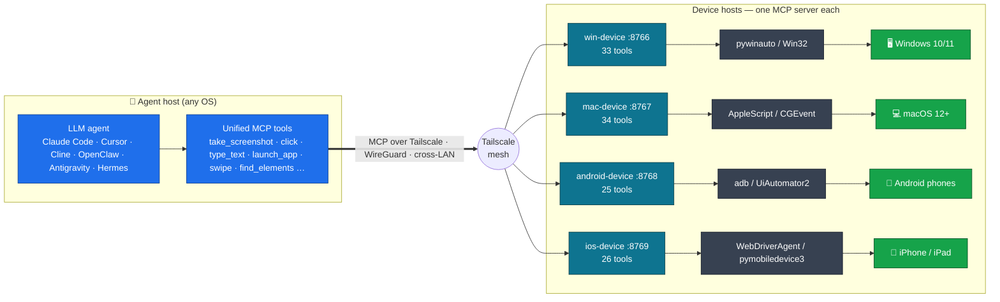

# agent-fleet

[](LICENSE)
[](https://github.com/metahub-tech/agent-fleet/releases/tag/v0.8.2-alpha)

[English](README.md) · [简体中文](README.zh-CN.md) · [日本語](README.ja.md) · [한국어](README.ko.md) · **Español** · [Français](README.fr.md) · [Deutsch](README.de.md) · [Português (BR)](README.pt-BR.md) · [Русский](README.ru.md)

<p align="center">
  
  <br><sub><em>Un agente LLM controlando un iPad real vía MCP, sin manos humanas.</em></sub>
</p>

> **Dale a tu agente LLM su propia flota de dispositivos físicos.**
> Conecta hardware real de Windows / macOS / Android / iOS a tu agente LLM mediante MCP para que los maneje como un humano. Instalación en un solo comando:
>
> ```bash
> uvx --from "git+https://github.com/metahub-tech/agent-fleet@v0.8.2-alpha#subdirectory=cli" agent-fleet setup
> ```

## Qué es

Lleva **dispositivos reales** —PC con Windows, Macs, teléfonos Android, iPhones— a la cadena de herramientas de tu agente LLM para que los controle igual que comandos locales: capturas de pantalla, pulsar botones, ejecutar pruebas, leer logs, depurar GUIs.

Es infraestructura para **pruebas de software impulsadas por agentes y verificación multiplataforma** y, en un sentido más amplio, una base para dar a los agentes percepción real e influencia sobre el mundo físico.

```
┌─────────────────┐                              ┌──────────────┐
│  Agent (any OS) │ ──── Tailscale Mesh ─────>  │ Windows PC   │ win-device     :8766 ✅
│  Claude Code /  │                              ├──────────────┤
│  Cursor / Cline │                              │ macOS box    │ mac-device     :8767 ✅
│  / OpenClaw /   │                              ├──────────────┤
│  Antigravity /  │                              │ Android phone│ android-device :8768 ✅
│  Hermes / ...   │                              ├──────────────┤
└─────────────────┘                              │ iPhone/iPad  │ ios-device     :8769 ✅
                                                 └──────────────┘
            ↑                                                ↑
   uvx agent-fleet setup           generates configs for 6 agent frameworks
   one command: install client + server / configure Tailscale / guide permissions / self-check / emit snippets
```

## Estado

| Componente | Versión | Estado |
|---|---|---|
| Puente Windows 10/11 | `0.2.0` | ✅ Publicado (win-device, 33 herramientas, streamable-http) |
| Puente macOS 12+ | `0.3.0` | ✅ Publicado (mac-device, launchd, 34 herramientas, flujo de permisos GUI) |
| Puente Android | `0.7.0-alpha` | ✅ Publicado (android-device, **25 herramientas**, multidispositivo + USB + inalámbrico + ADB híbrido) |
| Asistente CLI de agent-fleet | `0.5.0-alpha` | ✅ Publicado (`uvx agent-fleet setup` instalación en un paso; configs para 6 frameworks) |
| Renombrado de rol → `<os>-device` + guía de permisos macOS | `0.6.0-alpha` | ✅ Publicado |
| Parches v0.6.x (introspección de UI, smoke tests, correcciones, refuerzo del instalador…) | `0.6.1–0.6.15` | ✅ Publicado — ver [CHANGELOG.md](CHANGELOG.md) |
| Puente iOS / iPadOS | `0.8.0-alpha` | ✅ Publicado (ios-device, 26 herramientas, WebDriverAgent + pymobiledevice3, iPad verificado) |
| Demonio WDA de iOS (autoarranque + keep-alive) | `0.8.2-alpha` | ✅ Publicado (go-ios runwda + tunneld launchd; modos de firma gratuito/de pago) |
| Coordinación entre dispositivos | `0.9.0` | 🔭 Futuro |
| Versión estable pública | `1.0.0` | 🔭 Futuro (tras la retroalimentación de la comunidad sobre la alpha) |

Ver [`docs/roadmap.md`](docs/roadmap.md).

## Inicio rápido

**Principiantes / flujo en un paso** — en el dispositivo a controlar (un PC, o un PC con teléfonos conectados):

```bash
# macOS / Linux  —  NOT `curl ... | bash`!  The wizard is interactive and bash
# piped from curl uses stdin for the script itself, so questionary's prompts
# die with EOFError.  The `bash -c "$(...)"` form puts the script in argv and
# leaves stdin = terminal.
bash -c "$(curl -fsSL https://raw.githubusercontent.com/metahub-tech/agent-fleet/main/install.sh)"

# Windows  —  `irm | iex` is fine on PowerShell because iex runs the script in
# the current session and Read-Host reads from the console host, not stdin.
powershell -ExecutionPolicy Bypass -c "irm https://raw.githubusercontent.com/metahub-tech/agent-fleet/main/install.ps1 | iex"
```

O, si ya tienes uv (durante la fase v0.8.2-alpha se obtiene desde git, aún no está en PyPI):

```bash
uvx --from "git+https://github.com/metahub-tech/agent-fleet@v0.8.2-alpha#subdirectory=cli" agent-fleet setup
```

> Los usuarios de macOS 12 deben ejecutar primero `brew install coreutils` (el wrapper de uv usa `realpath`, que macOS 12 no incluye por defecto; ver [#2](https://github.com/metahub-tech/agent-fleet/issues/2)).

El asistente te guía por: elegir un rol → instalar el servidor MCP → configurar Tailscale → guía interactiva de permisos GUI / autorización ADB → comprobación de estado → emitir snippets de configuración para 6 frameworks de agentes.

Los **usuarios avanzados** aún pueden invocar directamente los scripts de bajo nivel — `docs/install-pattern.md` sigue siendo válido (el "manual avanzado").

| Eres | Lee |
|---|---|
| **Principiante** (deja que el asistente conduzca) | ejecuta el comando de arriba y sigue las indicaciones |
| **Administrador de dispositivos** (que automatiza su propio despliegue) | [`docs/install-pattern.md`](docs/install-pattern.md) (contrato de scripts de bajo nivel) |
| **Operador de agentes** | pega el snippet del asistente en la config de tu agente; ver también [`docs/agent-host-setup.md`](docs/agent-host-setup.md) |
| **Colaborador** (documentos de diseño) | [`docs/internal/design/2026-05-11-agent-fleet-cli.md`](docs/internal/design/2026-05-11-agent-fleet-cli.md) |

## Arquitectura



Cada puente de plataforma es la misma tubería de tres etapas:

```
[Agent Host] ── Tailscale ──> [Device Host] ── Native Drivers ──> [Device / App]
                  cross-LAN     MCP server         pywinauto / AppleScript / adb / xcrun
```

La interfaz de herramientas se mantiene semánticamente consistente entre plataformas (`take_screenshot` / `click` / `launch_app` / …); cambiar de dispositivo es solo cambiar una URL en `~/.claude.json`.

Ver [`docs/architecture.md`](docs/architecture.md).

## Estructura del repositorio

```
agent-fleet/
├── docs/                          # shared docs
│   ├── install-pattern.md         # developer baseline: two roles / two install paths / directory contract
│   ├── architecture.md            # common bridge architecture
│   ├── agent-host-setup.md        # agent-side config (~/.claude.json + skill symlinks)
│   ├── roadmap.md                 # platform roadmap
│   └── platforms/<name>.md        # per-platform manual (device side)
├── platforms/                     # one self-contained bay per platform
│   ├── windows/
│   │   ├── README.md              # at-a-glance
│   │   ├── server/                # MCP server source + deps
│   │   ├── scripts/               # install / launch / troubleshoot scripts
│   │   ├── skills/using-win/      # skill docs for the agent to use
│   │   └── examples/              # claude-settings.json snippets
│   └── macos/                     # same sub-structure
├── scripts/                       # repo-level scripts
│   └── install-agent-side.py      # one command to install MCP + skill into ~/.claude.json
├── examples/                      # cross-platform examples
│   └── multi-platform-claude-settings.json
└── CHANGELOG.md
```

Para añadir una plataforma → coloca la misma subestructura en `platforms/<name>/`. Ver [`docs/install-pattern.md` § Adding a new platform](docs/install-pattern.md).

## Licencia

[Apache 2.0](LICENSE)

## Contribuir

¡Las contribuciones son bienvenidas! **agent-fleet se publica bajo la licencia Apache 2.0 y acepta contribuciones de la comunidad.**

Consulta [`CONTRIBUTING.md`](CONTRIBUTING.md) para el flujo de contribución y las convenciones de código, y [`CODE_OF_CONDUCT.md`](CODE_OF_CONDUCT.md) para el código de conducta. Reporta vulnerabilidades de seguridad de forma privada mediante la pestaña Security de GitHub → "Report a vulnerability".
