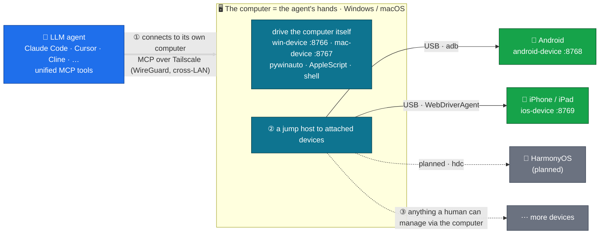

# agent-fleet

[](LICENSE)
[](https://github.com/metahub-tech/agent-fleet/releases/tag/v0.8.3-alpha)

[English](README.md) · [简体中文](README.zh-CN.md) · [日本語](README.ja.md) · [한국어](README.ko.md) · [Español](README.es.md) · **Français** · [Deutsch](README.de.md) · [Português (BR)](README.pt-BR.md) · [Русский](README.ru.md)

<p align="center">
  
  <br><sub><em>Un agent LLM pilotant un vrai iPad via MCP — sans mains humaines.</em></sub>
</p>

> **Donnez à votre agent LLM sa propre flotte d'appareils physiques.**
> Connectez du matériel réel Windows / macOS / Android / iOS à votre agent LLM via MCP pour qu'il les pilote comme un humain. Installation en une seule commande :
>
> ```bash
> uvx --from "git+https://github.com/metahub-tech/agent-fleet@v0.8.3-alpha#subdirectory=cli" agent-fleet setup
> ```

## Qu'est-ce que c'est

Intégrez des **appareils réels** — PC Windows, Mac, téléphones Android, iPhones — à la chaîne d'outils de votre agent LLM pour qu'il les pilote comme des commandes locales : captures d'écran, appuis sur des boutons, exécution de tests, lecture de logs, débogage d'interfaces.

C'est une infrastructure pour les **tests logiciels pilotés par agent et la vérification multiplateforme** — et, plus largement, un socle pour donner aux agents une perception réelle et un levier d'action sur le monde physique.

```
┌─────────────────┐                              ┌──────────────┐
│  Agent (any OS) │ ──── Tailscale Mesh ─────>  │ Windows PC   │ win-device     :8766 ✅
│  Claude Code /  │                              ├──────────────┤
│  Cursor / Cline │                              │ macOS box    │ mac-device     :8767 ✅
│  / OpenClaw /   │                              ├──────────────┤
│  Antigravity /  │                              │ Android phone│ android-device :8768 ✅
│  Hermes / ...   │                              ├──────────────┤
└─────────────────┘                              │ iPhone/iPad  │ ios-device     :8769 ✅
                                                 └──────────────┘
            ↑                                                ↑
   uvx agent-fleet setup           generates configs for 6 agent frameworks
   one command: install client + server / configure Tailscale / guide permissions / self-check / emit snippets
```

## État

| Composant | Version | État |
|---|---|---|
| Pont Windows 10/11 | `0.2.0` | ✅ Publié (win-device, 74 outils, streamable-http) |
| Pont macOS 12+ | `0.3.0` | ✅ Publié (mac-device, launchd, 73 outils, flux de permissions GUI) |
| Pont Android | `0.7.0-alpha` | ✅ Publié (android-device, **31 outils**, multi-appareils + USB + sans fil + ADB hybride) |
| Assistant CLI agent-fleet | `0.5.0-alpha` | ✅ Publié (`uvx agent-fleet setup` installation en une fois ; configs pour 6 frameworks) |
| Renommage de rôle → `<os>-device` + guide de permissions macOS | `0.6.0-alpha` | ✅ Publié |
| Correctifs v0.6.x (introspection UI, smoke tests, corrections, durcissement de l'installeur…) | `0.6.1–0.6.15` | ✅ Publié — voir [CHANGELOG.md](CHANGELOG.md) |
| Pont iOS / iPadOS | `0.8.0-alpha` | ✅ Publié (ios-device, 30 outils, WebDriverAgent + pymobiledevice3, iPad vérifié) |
| Démon WDA iOS (survie au démarrage + keep-alive) | `0.8.2-alpha` | ✅ Publié (go-ios runwda + tunneld launchd ; modes de signature gratuit/payant) |
| Coordination entre appareils | `0.10.0` | 🔭 À venir |
| Version stable publique | `1.0.0` | 🔭 À venir (après les retours de la communauté sur l'alpha) |

Voir [`docs/roadmap.md`](docs/roadmap.md).

## Démarrage rapide

**Débutants / flux en une étape** — sur l'appareil à contrôler (un PC, ou un PC avec des téléphones connectés) :

```bash
# macOS / Linux  —  NOT `curl ... | bash`!  The wizard is interactive and bash
# piped from curl uses stdin for the script itself, so questionary's prompts
# die with EOFError.  The `bash -c "$(...)"` form puts the script in argv and
# leaves stdin = terminal.
bash -c "$(curl -fsSL https://raw.githubusercontent.com/metahub-tech/agent-fleet/main/install.sh)"

# Windows  —  `irm | iex` is fine on PowerShell because iex runs the script in
# the current session and Read-Host reads from the console host, not stdin.
powershell -ExecutionPolicy Bypass -c "irm https://raw.githubusercontent.com/metahub-tech/agent-fleet/main/install.ps1 | iex"
```

Ou, si vous avez déjà uv (durant la phase v0.8.3-alpha, il est récupéré depuis git, pas encore sur PyPI) :

```bash
uvx --from "git+https://github.com/metahub-tech/agent-fleet@v0.8.3-alpha#subdirectory=cli" agent-fleet setup
```

> Les utilisateurs de macOS 12 doivent d'abord exécuter `brew install coreutils` (le wrapper d'uv utilise `realpath`, absent par défaut sur macOS 12 ; voir [#2](https://github.com/metahub-tech/agent-fleet/issues/2)).

L'assistant vous guide : choisir un rôle → installer le serveur MCP → configurer Tailscale → guide interactif des permissions GUI / autorisation ADB → contrôle de santé → produire des snippets de configuration pour 6 frameworks d'agents.

Les **utilisateurs avancés** peuvent toujours appeler directement les scripts bas niveau — `docs/install-pattern.md` reste valable (le « manuel avancé »).

| Vous êtes | À lire |
|---|---|
| **Débutant** (laissez l'assistant faire) | lancez la commande ci-dessus et suivez les invites |
| **Administrateur d'appareils** (qui scripte son propre déploiement) | [`docs/install-pattern.md`](docs/install-pattern.md) (contrat de scripts bas niveau) |
| **Opérateur d'agents** | collez le snippet de l'assistant dans la config de votre agent ; voir aussi [`docs/agent-host-setup.md`](docs/agent-host-setup.md) |
| **Contributeur** (documents de conception) | [`docs/internal/design/2026-05-11-agent-fleet-cli.md`](docs/internal/design/2026-05-11-agent-fleet-cli.md) |

## Architecture



L'agent se connecte à un **ordinateur** (Windows/macOS) — ses « mains » — et s'en sert à la fois pour piloter l'ordinateur lui-même et comme **rebond (jump host)** vers les appareils qui y sont connectés : Android et iOS aujourd'hui, HarmonyOS ensuite. En principe, tout appareil qu'un humain peut gérer via un ordinateur, l'agent le peut aussi (l'hôte iOS doit être un Mac).

L'interface des outils reste sémantiquement cohérente entre les plateformes (`take_screenshot` / `tap` / `launch_app` / …) ; changer d'appareil revient à changer une URL dans `~/.claude.json`.

Voir [`docs/architecture.md`](docs/architecture.md).

## Organisation du dépôt

```
agent-fleet/
├── docs/                          # shared docs
│   ├── install-pattern.md         # developer baseline: two roles / two install paths / directory contract
│   ├── architecture.md            # common bridge architecture
│   ├── agent-host-setup.md        # agent-side config (~/.claude.json + skill symlinks)
│   ├── roadmap.md                 # platform roadmap
│   └── platforms/<name>.md        # per-platform manual (device side)
├── platforms/                     # one self-contained bay per platform
│   ├── windows/
│   │   ├── README.md              # at-a-glance
│   │   ├── server/                # MCP server source + deps
│   │   ├── scripts/               # install / launch / troubleshoot scripts
│   │   ├── skills/using-win/      # skill docs for the agent to use
│   │   └── examples/              # claude-settings.json snippets
│   └── macos/                     # same sub-structure
├── scripts/                       # repo-level scripts
│   └── install-agent-side.py      # one command to install MCP + skill into ~/.claude.json
├── examples/                      # cross-platform examples
│   └── multi-platform-claude-settings.json
└── CHANGELOG.md
```

Pour ajouter une plateforme → déposez la même sous-structure dans `platforms/<name>/`. Voir [`docs/install-pattern.md` § Adding a new platform](docs/install-pattern.md).

## Licence

[Apache 2.0](LICENSE)

## Contribuer

Les contributions sont les bienvenues ! **agent-fleet est publié sous licence Apache 2.0 et accepte les contributions de la communauté.**

Consultez [`CONTRIBUTING.md`](CONTRIBUTING.md) pour le flux de contribution et les conventions de code, et [`CODE_OF_CONDUCT.md`](CODE_OF_CONDUCT.md) pour le code de conduite. Signalez les vulnérabilités de sécurité en privé via l'onglet Security de GitHub → « Report a vulnerability ».
