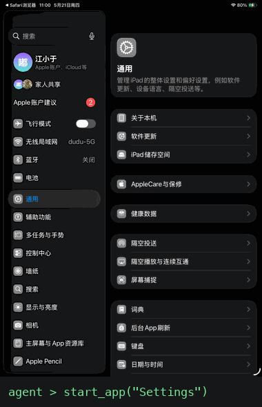
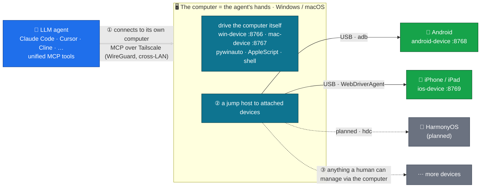

# agent-fleet

[](LICENSE)
[](https://github.com/metahub-tech/agent-fleet/releases/tag/v0.8.3-alpha)

[English](README.md) · [简体中文](README.zh-CN.md) · **日本語** · [한국어](README.ko.md) · [Español](README.es.md) · [Français](README.fr.md) · [Deutsch](README.de.md) · [Português (BR)](README.pt-BR.md) · [Русский](README.ru.md)

<p align="center">
  
  <br><sub><em>LLM エージェントが MCP 経由で実機 iPad を操作 —— 人の手を介さず。</em></sub>
</p>

> **LLM エージェントに、自分専用の実機フリートを。**
> 実機の Windows / macOS / Android / iOS ハードウェアを MCP 経由で LLM エージェントに接続し、人間のように操作させます。インストールはコマンド一発：
>
> ```bash
> uvx --from "git+https://github.com/metahub-tech/agent-fleet@v0.8.3-alpha#subdirectory=cli" agent-fleet setup
> ```

## これは何か

開発機の外にある**実機**（Windows PC、Mac、Android スマホ、iPhone）を LLM エージェントのツールチェーンに取り込み、ローカルコマンドのように操作させます：スクリーンショット、ボタンのタップ、テスト実行、ログ閲覧、GUI デバッグ。

これは **エージェント駆動のソフトウェアテストとクロスプラットフォーム検証** のためのインフラであり、さらに広く言えば、エージェントに物理世界の知覚と実際の影響力を与えるための土台です。

```
┌─────────────────┐                              ┌──────────────┐
│  Agent (any OS) │ ──── Tailscale Mesh ─────>  │ Windows PC   │ win-device     :8766 ✅
│  Claude Code /  │                              ├──────────────┤
│  Cursor / Cline │                              │ macOS box    │ mac-device     :8767 ✅
│  / OpenClaw /   │                              ├──────────────┤
│  Antigravity /  │                              │ Android phone│ android-device :8768 ✅
│  Hermes / ...   │                              ├──────────────┤
└─────────────────┘                              │ iPhone/iPad  │ ios-device     :8769 ✅
                                                 └──────────────┘
            ↑                                                ↑
   uvx agent-fleet setup           generates configs for 6 agent frameworks
   one command: install client + server / configure Tailscale / guide permissions / self-check / emit snippets
```

## ステータス

| コンポーネント | バージョン | ステータス |
|---|---|---|
| Windows 10/11 ブリッジ | `0.2.0` | ✅ リリース済（win-device、40 ツール、streamable-http）|
| macOS 12+ ブリッジ | `0.3.0` | ✅ リリース済（mac-device、launchd、41 ツール、GUI 権限フロー）|
| Android ブリッジ | `0.7.0-alpha` | ✅ リリース済（android-device、**25 ツール**、マルチデバイス + USB + 無線 + ハイブリッド ADB）|
| agent-fleet CLI ウィザード | `0.5.0-alpha` | ✅ リリース済（`uvx agent-fleet setup` ワンショットインストール；6 フレームワーク分の設定生成）|
| ロール改名 → `<os>-device` + macOS 権限ガイド | `0.6.0-alpha` | ✅ リリース済 |
| v0.6.x パッチ（UI イントロスペクション、smoke テスト、バグ修正、インストーラ強化…）| `0.6.1–0.6.15` | ✅ リリース済 —— [CHANGELOG.md](CHANGELOG.md) 参照 |
| iOS / iPadOS ブリッジ | `0.8.0-alpha` | ✅ リリース済（ios-device、26 ツール、WebDriverAgent + pymobiledevice3、iPad 検証済）|
| iOS WDA デーモン（起動時自動起動 + キープアライブ） | `0.8.2-alpha` | ✅ リリース済（go-ios runwda + tunneld launchd；無料/有料の署名モード）|
| デバイス間連携 | `0.10.0` | 🔭 今後 |
| 公開安定版 | `1.0.0` | 🔭 今後（alpha のコミュニティフィードバック後）|

詳細は [`docs/roadmap.md`](docs/roadmap.md)。

## クイックスタート

**初めての方 / ワンショット**：操作対象のデバイス（PC、またはスマホを接続した PC）上で：

```bash
# macOS / Linux  —  NOT `curl ... | bash`!  The wizard is interactive and bash
# piped from curl uses stdin for the script itself, so questionary's prompts
# die with EOFError.  The `bash -c "$(...)"` form puts the script in argv and
# leaves stdin = terminal.
bash -c "$(curl -fsSL https://raw.githubusercontent.com/metahub-tech/agent-fleet/main/install.sh)"

# Windows  —  `irm | iex` is fine on PowerShell because iex runs the script in
# the current session and Read-Host reads from the console host, not stdin.
powershell -ExecutionPolicy Bypass -c "irm https://raw.githubusercontent.com/metahub-tech/agent-fleet/main/install.ps1 | iex"
```

すでに uv をお持ちの場合（v0.8.3-alpha の段階では PyPI ではなく git から取得します）：

```bash
uvx --from "git+https://github.com/metahub-tech/agent-fleet@v0.8.3-alpha#subdirectory=cli" agent-fleet setup
```

> macOS 12 のユーザーは最初に `brew install coreutils` が必要です（uv のラッパーが `realpath` を使用し、macOS 12 には標準で含まれません。[#2](https://github.com/metahub-tech/agent-fleet/issues/2) 参照）。

ウィザードは次を案内します：ロール選択 → MCP サーバーのインストール → Tailscale 設定 → GUI 権限 / ADB 認可の対話ガイド → ヘルスチェック → 6 つのエージェントフレームワーク向け設定スニペットの出力。

**上級者**は引き続き低レベルスクリプトを直接呼べます —— `docs/install-pattern.md` は有効です（「上級者マニュアル」）。

| あなたは | 読むもの |
|---|---|
| **初心者**（ウィザードに任せる） | 上のコマンドを実行し、プロンプトに従う |
| **デバイス管理者**（自分でデプロイをスクリプト化） | [`docs/install-pattern.md`](docs/install-pattern.md)（低レベルスクリプト契約）|
| **エージェント運用者** | ウィザードが出力したスニペットをエージェント設定に貼り付け。[`docs/agent-host-setup.md`](docs/agent-host-setup.md) も参照 |
| **コントリビューター**（設計文書） | [`docs/internal/design/2026-05-11-agent-fleet-cli.md`](docs/internal/design/2026-05-11-agent-fleet-cli.md) |

## アーキテクチャ



エージェントはまず**コンピュータ**（Windows/macOS）——その"手"——に接続し、そのコンピュータ自体を操作すると同時に、接続された端末への**踏み台（jump host）**として使います：現在は Android と iOS、次は HarmonyOS。原理上、人がコンピュータ経由で管理できる端末なら、エージェントも管理できます（iOS のホストは Mac 必須）。

ツールインターフェースは全プラットフォームで意味的に一貫しています（`take_screenshot` / `tap` / `launch_app` / …）。デバイスの切り替えは `~/.claude.json` の URL を差し替えるだけです。

詳細は [`docs/architecture.md`](docs/architecture.md)。

## リポジトリ構成

```
agent-fleet/
├── docs/                          # shared docs
│   ├── install-pattern.md         # developer baseline: two roles / two install paths / directory contract
│   ├── architecture.md            # common bridge architecture
│   ├── agent-host-setup.md        # agent-side config (~/.claude.json + skill symlinks)
│   ├── roadmap.md                 # platform roadmap
│   └── platforms/<name>.md        # per-platform manual (device side)
├── platforms/                     # one self-contained bay per platform
│   ├── windows/
│   │   ├── README.md              # at-a-glance
│   │   ├── server/                # MCP server source + deps
│   │   ├── scripts/               # install / launch / troubleshoot scripts
│   │   ├── skills/using-win/      # skill docs for the agent to use
│   │   └── examples/              # claude-settings.json snippets
│   └── macos/                     # same sub-structure
├── scripts/                       # repo-level scripts
│   └── install-agent-side.py      # one command to install MCP + skill into ~/.claude.json
├── examples/                      # cross-platform examples
│   └── multi-platform-claude-settings.json
└── CHANGELOG.md
```

プラットフォームを追加するには → `platforms/<name>/` に同じサブ構成を置きます。[`docs/install-pattern.md` § Adding a new platform](docs/install-pattern.md) 参照。

## ライセンス

[Apache 2.0](LICENSE)

## コントリビュート

コントリビューション歓迎です！**agent-fleet は Apache 2.0 ライセンスで公開され、コミュニティからの貢献を受け付けています。**

貢献フローとコーディング規約は [`CONTRIBUTING.md`](CONTRIBUTING.md)、行動規範は [`CODE_OF_CONDUCT.md`](CODE_OF_CONDUCT.md) を参照してください。セキュリティ脆弱性は GitHub Security タブ → "Report a vulnerability" から非公開で報告してください。
