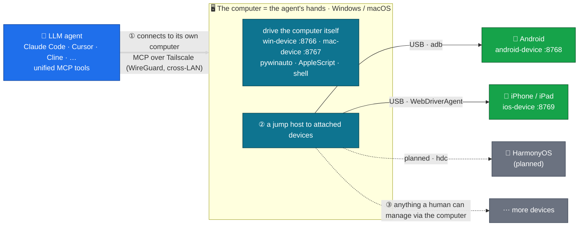

# agent-fleet

[](LICENSE)
[](https://github.com/metahub-tech/agent-fleet/releases/tag/v0.8.3-alpha)

**English** · [简体中文](README.zh-CN.md) · [日本語](README.ja.md) · [한국어](README.ko.md) · [Español](README.es.md) · [Français](README.fr.md) · [Deutsch](README.de.md) · [Português (BR)](README.pt-BR.md) · [Русский](README.ru.md)

<p align="center">
  
  <br><sub><em>An LLM agent driving a real iPad over MCP — no human hands.</em></sub>
</p>

> **Give your LLM agent its own fleet of physical devices.**
> Connect real Windows / macOS / Android / iOS hardware to your LLM agent over MCP so it can operate them like a human. One command to install:
>
> ```bash
> uvx --from "git+https://github.com/metahub-tech/agent-fleet@v0.8.3-alpha#subdirectory=cli" agent-fleet setup
> ```

## What is it

Bring **real devices** — Windows PCs, Macs, Android phones, iPhones — into your LLM agent's toolchain so it can drive them just like local commands: take screenshots, tap buttons, run tests, read logs, debug GUIs.

This is infrastructure for **agent-driven software testing and cross-platform verification** — and, more broadly, for giving agents real perception of and leverage over the physical world.

```
┌─────────────────┐                              ┌──────────────┐
│  Agent (any OS) │ ──── Tailscale Mesh ─────>  │ Windows PC   │ win-device     :8766 ✅
│  Claude Code /  │                              ├──────────────┤
│  Cursor / Cline │                              │ macOS box    │ mac-device     :8767 ✅
│  / OpenClaw /   │                              ├──────────────┤
│  Antigravity /  │                              │ Android phone│ android-device :8768 ✅
│  Hermes / ...   │                              ├──────────────┤
└─────────────────┘                              │ iPhone/iPad  │ ios-device     :8769 ✅
                                                 └──────────────┘
            ↑                                                ↑
   uvx agent-fleet setup           generates configs for 6 agent frameworks
   one command: install client + server / configure Tailscale / guide permissions / self-check / emit snippets
```

## Status

| Component | Version | Status |
|---|---|---|
| Windows 10/11 bridge | `0.2.0` | ✅ Released (win-device, 74 tools — 43 core+discovery, +27 agent_browser, +1 human_browser, +3 vision (browser caps need Chrome/node); streamable-http) |
| macOS 12+ bridge | `0.3.0` | ✅ Released (mac-device, launchd, 73 tools — 42 core+discovery, +27 agent_browser, +1 human_browser, +3 vision (browser caps need Chrome/node); GUI-permission flow) |
| Android bridge | `0.7.0-alpha` | ✅ Released (android-device, **31 tools**, multi-device + USB + Wireless + Hybrid ADB) |
| agent-fleet CLI wizard | `0.5.0-alpha` | ✅ Released (`uvx agent-fleet setup` one-shot install; configs for 6 frameworks) |
| role rename → `<os>-device` + macOS permission primer | `0.6.0-alpha` | ✅ Released |
| v0.6.x patches (UI introspection, smoke tests, bugfixes, installer hardening…) | `0.6.1–0.6.15` | ✅ Released — see [CHANGELOG.md](CHANGELOG.md) |
| iOS / iPadOS bridge | `0.8.0-alpha` | ✅ Released (ios-device, 30 tools, WebDriverAgent + pymobiledevice3, iPad verified) |
| iOS WDA daemon (boot-survival + keep-alive) | `0.8.2-alpha` | ✅ Released (go-ios runwda + tunneld launchd; free/paid signing modes) |
| Cross-device coordination | `0.10.0` | 🔭 Future |
| Public stable release | `1.0.0` | 🔭 Future (after community feedback on the alpha) |

See [`docs/roadmap.md`](docs/roadmap.md).

## Quick Start

**Newcomers / one-shot flow** — on the device to be controlled (a PC, or a PC with phones attached):

```bash
# macOS / Linux  —  NOT `curl ... | bash`!  The wizard is interactive and bash
# piped from curl uses stdin for the script itself, so questionary's prompts
# die with EOFError.  The `bash -c "$(...)"` form puts the script in argv and
# leaves stdin = terminal.
bash -c "$(curl -fsSL https://raw.githubusercontent.com/metahub-tech/agent-fleet/main/install.sh)"

# Windows  —  `irm | iex` is fine on PowerShell because iex runs the script in
# the current session and Read-Host reads from the console host, not stdin.
powershell -ExecutionPolicy Bypass -c "irm https://raw.githubusercontent.com/metahub-tech/agent-fleet/main/install.ps1 | iex"
```

Or, if you already have uv (during the v0.8.3-alpha phase it is pulled from git, not yet on PyPI):

```bash
uvx --from "git+https://github.com/metahub-tech/agent-fleet@v0.8.3-alpha#subdirectory=cli" agent-fleet setup
```

> macOS 12 users must run `brew install coreutils` first (uv's wrapper uses `realpath`, which macOS 12 lacks by default; see [#2](https://github.com/metahub-tech/agent-fleet/issues/2)).

The wizard walks you through: pick a role → install the MCP server → configure Tailscale → interactively guide GUI permissions / ADB authorization → run a health check → emit config snippets for 6 agent frameworks.

**Power users** can still call the underlying scripts directly — `docs/install-pattern.md` remains valid (the "advanced manual").

| You are | Read |
|---|---|
| **A newcomer** (let the wizard drive) | run the command above and follow the prompts |
| **A device admin scripting your own deployment** | [`docs/install-pattern.md`](docs/install-pattern.md) (low-level script contract) |
| **An agent operator** | paste the wizard's snippet into your agent config; see also [`docs/agent-host-setup.md`](docs/agent-host-setup.md) |
| **A contributor** (design docs) | [`docs/internal/design/2026-05-11-agent-fleet-cli.md`](docs/internal/design/2026-05-11-agent-fleet-cli.md) |

## Architecture



The agent connects to a **computer** (Windows/macOS) — its "hands" — and uses it both to drive the computer directly and as a **jump host** to the devices attached to it: Android and iOS today, HarmonyOS next. In principle, any device a human can manage through a computer, the agent can too. (The iOS host must be a Mac.)

The tool interface stays semantically consistent across platforms (`take_screenshot` / `tap` / `launch_app` / …); switching devices is just swapping a URL in `~/.claude.json`.

See [`docs/architecture.md`](docs/architecture.md).

## Repository layout

```
agent-fleet/
├── docs/                          # shared docs
│   ├── install-pattern.md         # developer baseline: two roles / two install paths / directory contract
│   ├── architecture.md            # common bridge architecture
│   ├── agent-host-setup.md        # agent-side config (~/.claude.json + skill symlinks)
│   ├── roadmap.md                 # platform roadmap
│   └── platforms/<name>.md        # per-platform manual (device side)
├── platforms/                     # one self-contained bay per platform
│   ├── windows/
│   │   ├── platform.toml          # manifest: id / port / host_os / enabled capabilities
│   │   ├── README.md              # at-a-glance
│   │   ├── server/                # MCP server source + deps
│   │   ├── scripts/               # install / launch / troubleshoot scripts
│   │   ├── skills/using-win/      # skill docs for the agent to use
│   │   └── examples/              # claude-settings.json snippets
│   ├── macos/                     # same sub-structure
│   ├── android/                   # same sub-structure
│   └── ios/                       # same sub-structure
├── scripts/                       # repo-level scripts
│   └── install-agent-side.py      # one command to install MCP + skill into ~/.claude.json
├── examples/                      # cross-platform examples
│   └── multi-platform-claude-settings.json
└── CHANGELOG.md
```

To add a platform → drop the same sub-structure under `platforms/<name>/`. See [`docs/install-pattern.md` § Adding a new platform](docs/install-pattern.md).

## License

[Apache 2.0](LICENSE)

## Contributing

Contributions welcome! **agent-fleet is publicly released under the Apache 2.0 license and accepts community contributions.**

See [`CONTRIBUTING.md`](CONTRIBUTING.md) for the contribution flow and coding conventions, and [`CODE_OF_CONDUCT.md`](CODE_OF_CONDUCT.md) for the code of conduct. Report security vulnerabilities privately via the GitHub Security tab → "Report a vulnerability".
