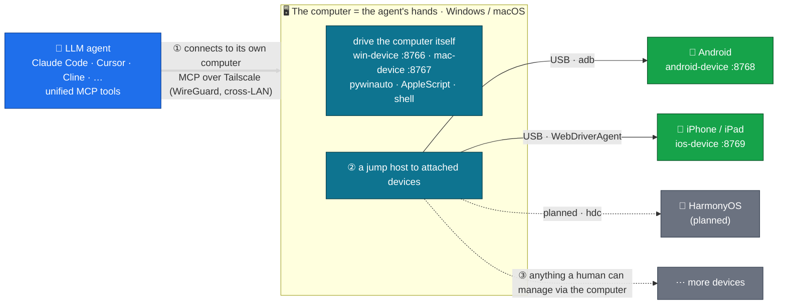

# agent-fleet

[](LICENSE)
[](https://github.com/metahub-tech/agent-fleet/releases/tag/v0.8.3-alpha)

[English](README.md) · [简体中文](README.zh-CN.md) · [日本語](README.ja.md) · [한국어](README.ko.md) · [Español](README.es.md) · [Français](README.fr.md) · [Deutsch](README.de.md) · **Português (BR)** · [Русский](README.ru.md)

<p align="center">
  
  <br><sub><em>Um agente LLM controlando um iPad real via MCP — sem mãos humanas.</em></sub>
</p>

> **Dê ao seu agente LLM sua própria frota de dispositivos físicos.**
> Conecte hardware real de Windows / macOS / Android / iOS ao seu agente LLM via MCP para que ele os opere como um humano. Instalação em um único comando:
>
> ```bash
> uvx --from "git+https://github.com/metahub-tech/agent-fleet@v0.8.3-alpha#subdirectory=cli" agent-fleet setup
> ```

## O que é

Traga **dispositivos reais** — PCs Windows, Macs, celulares Android, iPhones — para a cadeia de ferramentas do seu agente LLM, para que ele os controle como comandos locais: capturas de tela, tocar botões, rodar testes, ler logs, depurar GUIs.

É infraestrutura para **testes de software conduzidos por agentes e verificação multiplataforma** — e, num sentido mais amplo, uma base para dar aos agentes percepção real e influência sobre o mundo físico.

```
┌─────────────────┐                              ┌──────────────┐
│  Agent (any OS) │ ──── Tailscale Mesh ─────>  │ Windows PC   │ win-device     :8766 ✅
│  Claude Code /  │                              ├──────────────┤
│  Cursor / Cline │                              │ macOS box    │ mac-device     :8767 ✅
│  / OpenClaw /   │                              ├──────────────┤
│  Antigravity /  │                              │ Android phone│ android-device :8768 ✅
│  Hermes / ...   │                              ├──────────────┤
└─────────────────┘                              │ iPhone/iPad  │ ios-device     :8769 ✅
                                                 └──────────────┘
            ↑                                                ↑
   uvx agent-fleet setup           generates configs for 6 agent frameworks
   one command: install client + server / configure Tailscale / guide permissions / self-check / emit snippets
```

## Status

| Componente | Versão | Status |
|---|---|---|
| Ponte Windows 10/11 | `0.2.0` | ✅ Lançado (win-device, 74 ferramentas, streamable-http) |
| Ponte macOS 12+ | `0.3.0` | ✅ Lançado (mac-device, launchd, 73 ferramentas, fluxo de permissões GUI) |
| Ponte Android | `0.7.0-alpha` | ✅ Lançado (android-device, **31 ferramentas**, multidispositivo + USB + sem fio + ADB híbrido) |
| Assistente CLI do agent-fleet | `0.5.0-alpha` | ✅ Lançado (`uvx agent-fleet setup` instalação em um passo; configs para 6 frameworks) |
| Renomeação de papel → `<os>-device` + guia de permissões macOS | `0.6.0-alpha` | ✅ Lançado |
| Patches v0.6.x (introspecção de UI, smoke tests, correções, fortalecimento do instalador…) | `0.6.1–0.6.15` | ✅ Lançado — ver [CHANGELOG.md](CHANGELOG.md) |
| Ponte iOS / iPadOS | `0.8.0-alpha` | ✅ Lançado (ios-device, 30 ferramentas, WebDriverAgent + pymobiledevice3, iPad verificado) |
| Daemon WDA do iOS (autostart no boot + keep-alive) | `0.8.2-alpha` | ✅ Lançado (go-ios runwda + tunneld launchd; modos de assinatura gratuito/pago) |
| Coordenação entre dispositivos | `0.10.0` | 🔭 Futuro |
| Versão estável pública | `1.0.0` | 🔭 Futuro (após feedback da comunidade sobre a alpha) |

Ver [`docs/roadmap.md`](docs/roadmap.md).

## Início rápido

**Iniciantes / fluxo em um passo** — no dispositivo a ser controlado (um PC, ou um PC com celulares conectados):

```bash
# macOS / Linux  —  NOT `curl ... | bash`!  The wizard is interactive and bash
# piped from curl uses stdin for the script itself, so questionary's prompts
# die with EOFError.  The `bash -c "$(...)"` form puts the script in argv and
# leaves stdin = terminal.
bash -c "$(curl -fsSL https://raw.githubusercontent.com/metahub-tech/agent-fleet/main/install.sh)"

# Windows  —  `irm | iex` is fine on PowerShell because iex runs the script in
# the current session and Read-Host reads from the console host, not stdin.
powershell -ExecutionPolicy Bypass -c "irm https://raw.githubusercontent.com/metahub-tech/agent-fleet/main/install.ps1 | iex"
```

Ou, se você já tem o uv (durante a fase v0.8.3-alpha ele é baixado do git, ainda não está no PyPI):

```bash
uvx --from "git+https://github.com/metahub-tech/agent-fleet@v0.8.3-alpha#subdirectory=cli" agent-fleet setup
```

> Usuários de macOS 12 precisam rodar `brew install coreutils` primeiro (o wrapper do uv usa `realpath`, ausente por padrão no macOS 12; ver [#2](https://github.com/metahub-tech/agent-fleet/issues/2)).

O assistente conduz você por: escolher um papel → instalar o servidor MCP → configurar o Tailscale → guia interativo de permissões GUI / autorização ADB → verificação de saúde → emitir snippets de configuração para 6 frameworks de agentes.

**Usuários avançados** ainda podem chamar os scripts de baixo nível diretamente — `docs/install-pattern.md` continua válido (o "manual avançado").

| Você é | Leia |
|---|---|
| **Iniciante** (deixe o assistente conduzir) | rode o comando acima e siga os prompts |
| **Administrador de dispositivos** (que automatiza o próprio deploy) | [`docs/install-pattern.md`](docs/install-pattern.md) (contrato de scripts de baixo nível) |
| **Operador de agentes** | cole o snippet do assistente na config do seu agente; ver também [`docs/agent-host-setup.md`](docs/agent-host-setup.md) |
| **Contribuidor** (documentos de design) | [`docs/internal/design/2026-05-11-agent-fleet-cli.md`](docs/internal/design/2026-05-11-agent-fleet-cli.md) |

## Arquitetura



O agente se conecta a um **computador** (Windows/macOS) — suas "mãos" — e o usa tanto para controlar o próprio computador quanto como **jump host** para os dispositivos conectados a ele: hoje Android e iOS, em seguida HarmonyOS. Em princípio, qualquer dispositivo que um humano consiga gerenciar por um computador, o agente também consegue (o host de iOS precisa ser um Mac).

A interface de ferramentas permanece semanticamente consistente entre plataformas (`take_screenshot` / `tap` / `launch_app` / …); trocar de dispositivo é apenas trocar uma URL em `~/.claude.json`.

Ver [`docs/architecture.md`](docs/architecture.md).

## Estrutura do repositório

```
agent-fleet/
├── docs/                          # shared docs
│   ├── install-pattern.md         # developer baseline: two roles / two install paths / directory contract
│   ├── architecture.md            # common bridge architecture
│   ├── agent-host-setup.md        # agent-side config (~/.claude.json + skill symlinks)
│   ├── roadmap.md                 # platform roadmap
│   └── platforms/<name>.md        # per-platform manual (device side)
├── platforms/                     # one self-contained bay per platform
│   ├── windows/
│   │   ├── README.md              # at-a-glance
│   │   ├── server/                # MCP server source + deps
│   │   ├── scripts/               # install / launch / troubleshoot scripts
│   │   ├── skills/using-win/      # skill docs for the agent to use
│   │   └── examples/              # claude-settings.json snippets
│   └── macos/                     # same sub-structure
├── scripts/                       # repo-level scripts
│   └── install-agent-side.py      # one command to install MCP + skill into ~/.claude.json
├── examples/                      # cross-platform examples
│   └── multi-platform-claude-settings.json
└── CHANGELOG.md
```

Para adicionar uma plataforma → coloque a mesma subestrutura em `platforms/<name>/`. Ver [`docs/install-pattern.md` § Adding a new platform](docs/install-pattern.md).

## Licença

[Apache 2.0](LICENSE)

## Contribuindo

Contribuições são bem-vindas! **O agent-fleet é publicado sob a licença Apache 2.0 e aceita contribuições da comunidade.**

Veja [`CONTRIBUTING.md`](CONTRIBUTING.md) para o fluxo de contribuição e as convenções de código, e [`CODE_OF_CONDUCT.md`](CODE_OF_CONDUCT.md) para o código de conduta. Relate vulnerabilidades de segurança de forma privada pela aba Security do GitHub → "Report a vulnerability".
