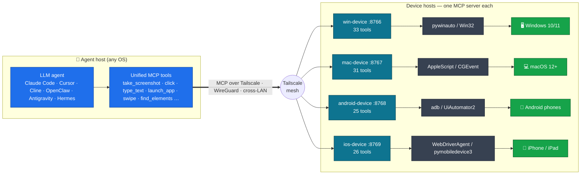

# agent-fleet

[](LICENSE)
[](https://github.com/metahub-tech/agent-fleet/releases/tag/v0.8.2-alpha)

[English](README.md) · [简体中文](README.zh-CN.md) · [日本語](README.ja.md) · [한국어](README.ko.md) · [Español](README.es.md) · [Français](README.fr.md) · [Deutsch](README.de.md) · [Português (BR)](README.pt-BR.md) · **Русский**

<p align="center">
  
  <br><sub><em>LLM-агент управляет реальным iPad через MCP — без участия рук.</em></sub>
</p>

> **Дайте вашему LLM-агенту собственный флот физических устройств.**
> Подключите реальное оборудование Windows / macOS / Android / iOS к LLM-агенту через MCP, чтобы он управлял им как человек. Установка одной командой:
>
> ```bash
> uvx --from "git+https://github.com/metahub-tech/agent-fleet@v0.8.2-alpha#subdirectory=cli" agent-fleet setup
> ```

## Что это

Добавьте **реальные устройства** — ПК на Windows, Mac, Android-телефоны, iPhone — в инструментальную цепочку вашего LLM-агента, чтобы он управлял ими как локальными командами: скриншоты, нажатие кнопок, запуск тестов, чтение логов, отладка GUI.

Это инфраструктура для **тестирования ПО под управлением агентов и кроссплатформенной верификации** — и, в более широком смысле, основа для того, чтобы дать агентам реальное восприятие физического мира и рычаги воздействия на него.

```
┌─────────────────┐                              ┌──────────────┐
│  Agent (any OS) │ ──── Tailscale Mesh ─────>  │ Windows PC   │ win-device     :8766 ✅
│  Claude Code /  │                              ├──────────────┤
│  Cursor / Cline │                              │ macOS box    │ mac-device     :8767 ✅
│  / OpenClaw /   │                              ├──────────────┤
│  Antigravity /  │                              │ Android phone│ android-device :8768 ✅
│  Hermes / ...   │                              ├──────────────┤
└─────────────────┘                              │ iPhone/iPad  │ ios-device     :8769 ✅
                                                 └──────────────┘
            ↑                                                ↑
   uvx agent-fleet setup           generates configs for 6 agent frameworks
   one command: install client + server / configure Tailscale / guide permissions / self-check / emit snippets
```

## Статус

| Компонент | Версия | Статус |
|---|---|---|
| Мост Windows 10/11 | `0.2.0` | ✅ Выпущен (win-device, 33 инструмента, streamable-http) |
| Мост macOS 12+ | `0.3.0` | ✅ Выпущен (mac-device, launchd, 31 инструмент, процесс выдачи GUI-разрешений) |
| Мост Android | `0.7.0-alpha` | ✅ Выпущен (android-device, **25 инструментов**, мультиустройства + USB + беспроводной + гибридный ADB) |
| CLI-мастер agent-fleet | `0.5.0-alpha` | ✅ Выпущен (`uvx agent-fleet setup` установка в один шаг; конфиги для 6 фреймворков) |
| Переименование роли → `<os>-device` + гайд по разрешениям macOS | `0.6.0-alpha` | ✅ Выпущен |
| Патчи v0.6.x (интроспекция UI, smoke-тесты, исправления, усиление защиты установщика…) | `0.6.1–0.6.15` | ✅ Выпущены — см. [CHANGELOG.md](CHANGELOG.md) |
| Мост iOS / iPadOS | `0.8.0-alpha` | ✅ Выпущен (ios-device, 26 инструментов, WebDriverAgent + pymobiledevice3, iPad проверен) |
| Демон WDA для iOS (автозапуск при загрузке + keep-alive) | `0.8.2-alpha` | ✅ Выпущен (go-ios runwda + tunneld launchd; бесплатный/платный режимы подписи) |
| Координация между устройствами | `0.9.0` | 🔭 В будущем |
| Публичный стабильный релиз | `1.0.0` | 🔭 В будущем (после отзывов сообщества об альфе) |

См. [`docs/roadmap.md`](docs/roadmap.md).

## Быстрый старт

**Новичкам / поток в один шаг** — на управляемом устройстве (ПК или ПК с подключёнными телефонами):

```bash
# macOS / Linux  —  NOT `curl ... | bash`!  The wizard is interactive and bash
# piped from curl uses stdin for the script itself, so questionary's prompts
# die with EOFError.  The `bash -c "$(...)"` form puts the script in argv and
# leaves stdin = terminal.
bash -c "$(curl -fsSL https://raw.githubusercontent.com/metahub-tech/agent-fleet/main/install.sh)"

# Windows  —  `irm | iex` is fine on PowerShell because iex runs the script in
# the current session and Read-Host reads from the console host, not stdin.
powershell -ExecutionPolicy Bypass -c "irm https://raw.githubusercontent.com/metahub-tech/agent-fleet/main/install.ps1 | iex"
```

Или, если у вас уже есть uv (на этапе v0.8.2-alpha он берётся из git, ещё не в PyPI):

```bash
uvx --from "git+https://github.com/metahub-tech/agent-fleet@v0.8.2-alpha#subdirectory=cli" agent-fleet setup
```

> Пользователям macOS 12 нужно сначала выполнить `brew install coreutils` (обёртка uv использует `realpath`, которого по умолчанию нет в macOS 12; см. [#2](https://github.com/metahub-tech/agent-fleet/issues/2)).

Мастер проведёт вас через: выбор роли → установку MCP-сервера → настройку Tailscale → интерактивный гайд по GUI-разрешениям / авторизации ADB → проверку работоспособности → вывод сниппетов конфигурации для 6 фреймворков агентов.

**Опытные пользователи** по-прежнему могут вызывать низкоуровневые скрипты напрямую — `docs/install-pattern.md` остаётся актуальным («продвинутое руководство»).

| Вы | Читайте |
|---|---|
| **Новичок** (доверьтесь мастеру) | выполните команду выше и следуйте подсказкам |
| **Администратор устройств** (скриптующий своё развёртывание) | [`docs/install-pattern.md`](docs/install-pattern.md) (контракт низкоуровневых скриптов) |
| **Оператор агентов** | вставьте сниппет мастера в конфиг агента; см. также [`docs/agent-host-setup.md`](docs/agent-host-setup.md) |
| **Контрибьютор** (документы по дизайну) | [`docs/internal/design/2026-05-11-agent-fleet-cli.md`](docs/internal/design/2026-05-11-agent-fleet-cli.md) |

## Архитектура



Каждый мост платформы — это один и тот же трёхэтапный конвейер:

```
[Agent Host] ── Tailscale ──> [Device Host] ── Native Drivers ──> [Device / App]
                  cross-LAN     MCP server         pywinauto / AppleScript / adb / xcrun
```

Интерфейс инструментов остаётся семантически согласованным на всех платформах (`take_screenshot` / `click` / `launch_app` / …); смена устройства — это просто замена URL в `~/.claude.json`.

См. [`docs/architecture.md`](docs/architecture.md).

## Структура репозитория

```
agent-fleet/
├── docs/                          # shared docs
│   ├── install-pattern.md         # developer baseline: two roles / two install paths / directory contract
│   ├── architecture.md            # common bridge architecture
│   ├── agent-host-setup.md        # agent-side config (~/.claude.json + skill symlinks)
│   ├── roadmap.md                 # platform roadmap
│   └── platforms/<name>.md        # per-platform manual (device side)
├── platforms/                     # one self-contained bay per platform
│   ├── windows/
│   │   ├── README.md              # at-a-glance
│   │   ├── server/                # MCP server source + deps
│   │   ├── scripts/               # install / launch / troubleshoot scripts
│   │   ├── skills/using-win/      # skill docs for the agent to use
│   │   └── examples/              # claude-settings.json snippets
│   └── macos/                     # same sub-structure
├── scripts/                       # repo-level scripts
│   └── install-agent-side.py      # one command to install MCP + skill into ~/.claude.json
├── examples/                      # cross-platform examples
│   └── multi-platform-claude-settings.json
└── CHANGELOG.md
```

Чтобы добавить платформу → разместите ту же подструктуру в `platforms/<name>/`. См. [`docs/install-pattern.md` § Adding a new platform](docs/install-pattern.md).

## Лицензия

[Apache 2.0](LICENSE)

## Участие

Вклад приветствуется! **agent-fleet опубликован под лицензией Apache 2.0 и принимает вклад сообщества.**

См. [`CONTRIBUTING.md`](CONTRIBUTING.md) для процесса внесения вклада и соглашений по коду, а также [`CODE_OF_CONDUCT.md`](CODE_OF_CONDUCT.md) для кодекса поведения. Сообщайте об уязвимостях безопасности приватно через вкладку Security на GitHub → «Report a vulnerability».
