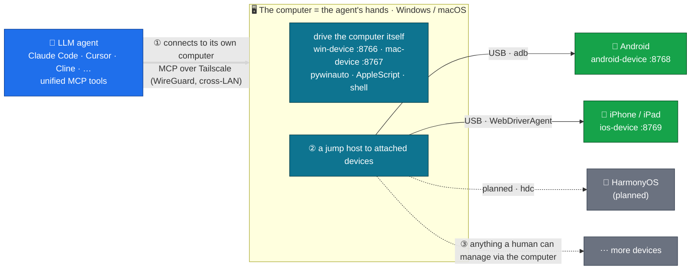

# agent-fleet

[](LICENSE)
[](https://github.com/metahub-tech/agent-fleet/releases/tag/v0.8.2-alpha)

[English](README.md) · **简体中文** · [日本語](README.ja.md) · [한국어](README.ko.md) · [Español](README.es.md) · [Français](README.fr.md) · [Deutsch](README.de.md) · [Português (BR)](README.pt-BR.md) · [Русский](README.ru.md)

<p align="center">
  
  <br><sub><em>一个 LLM agent 通过 MCP 操作真实 iPad —— 全程无人手。</em></sub>
</p>

> **给 LLM agent 配一队真实设备。**
> 通过 MCP 把真实的 Windows / macOS / Android / iOS 硬件接进 LLM agent，让 agent 像人一样操作它们。一行命令安装：
>
> ```bash
> uvx --from "git+https://github.com/metahub-tech/agent-fleet@v0.8.2-alpha#subdirectory=cli" agent-fleet setup
> ```

## 是什么

把开发机之外的**真实设备**（Windows PC、Mac、Android 手机、iPhone）接进 LLM agent 的工具链，让 agent 像调用本地命令那样驱动它们：截屏、点按钮、跑测试、读日志、调试 GUI。

这是给 **agent 驱动的软件测试与跨平台验证** 准备的基础设施 —— 更广义地说，是让 agent 真正感知并撬动物理世界的底座。

```
┌─────────────────┐                              ┌──────────────┐
│  Agent (any OS) │ ──── Tailscale Mesh ─────>  │ Windows PC   │ win-device     :8766 ✅
│  Claude Code /  │                              ├──────────────┤
│  Cursor / Cline │                              │ macOS box    │ mac-device     :8767 ✅
│  / OpenClaw /   │                              ├──────────────┤
│  Antigravity /  │                              │ Android phone│ android-device :8768 ✅
│  Hermes / ...   │                              ├──────────────┤
└─────────────────┘                              │ iPhone/iPad  │ ios-device     :8769 ✅
                                                 └──────────────┘
            ↑                                                ↑
   uvx agent-fleet setup           generates configs for 6 agent frameworks
   one command: install client + server / configure Tailscale / guide permissions / self-check / emit snippets
```

## 当前状态

| 组件 | 版本 | 状态 |
|---|---|---|
| Windows 10/11 桥 | `0.2.0` | ✅ 已发布（win-device，40 工具，streamable-http）|
| macOS 12+ 桥 | `0.3.0` | ✅ 已发布（mac-device，launchd，41 工具，GUI 权限流程）|
| Android 桥 | `0.7.0-alpha` | ✅ 已发布（android-device，**25 工具**，多设备 + USB + 无线 + 混合 ADB）|
| agent-fleet CLI wizard | `0.5.0-alpha` | ✅ 已发布（`uvx agent-fleet setup` 一键安装；6 框架配置生成）|
| 角色改名 → `<os>-device` + macOS 权限引导 | `0.6.0-alpha` | ✅ 已发布 |
| v0.6.x 补丁（UI 自省、smoke 测试、bugfix、安装器加固…）| `0.6.1–0.6.15` | ✅ 已发布 —— 见 [CHANGELOG.md](CHANGELOG.md) |
| iOS / iPadOS 桥 | `0.8.0-alpha` | ✅ 已发布（ios-device，26 工具，WebDriverAgent + pymobiledevice3，iPad 已验证）|
| iOS WDA daemon（开机自启 + 保活） | `0.8.2-alpha` | ✅ 已发布（go-ios runwda + tunneld launchd；免费/付费签名双模式）|
| 跨设备协同 | `0.10.0` | 🔭 未来 |
| 公开稳定版 | `1.0.0` | 🔭 未来（待 alpha 社区反馈后）|

详见 [`docs/roadmap.md`](docs/roadmap.md)。

## 快速开始

**新手 / 一键流**：在被控设备（PC / 接了手机的 PC）上：

```bash
# macOS / Linux  —  不要用 `curl ... | bash`！wizard 是交互式的，curl 管道把 bash 的
# stdin 占用给了脚本本身，questionary 的提示会以 EOFError 挂掉。`bash -c "$(...)"`
# 形式把脚本放进 argv，stdin 留给终端。
bash -c "$(curl -fsSL https://raw.githubusercontent.com/metahub-tech/agent-fleet/main/install.sh)"

# Windows  —  PowerShell 上 `irm | iex` 没问题：iex 在当前会话里跑脚本，Read-Host
# 从控制台主机而非 stdin 读取。
powershell -ExecutionPolicy Bypass -c "irm https://raw.githubusercontent.com/metahub-tech/agent-fleet/main/install.ps1 | iex"
```

或，如果已经有 uv（v0.8.2-alpha 阶段从 git 拉，未上 PyPI）：

```bash
uvx --from "git+https://github.com/metahub-tech/agent-fleet@v0.8.2-alpha#subdirectory=cli" agent-fleet setup
```

> macOS 12 用户首次跑前需 `brew install coreutils`（uv 的 wrapper 用到 `realpath`，macOS 12 默认不带；见 [#2](https://github.com/metahub-tech/agent-fleet/issues/2)）。

wizard 会带你走完：选角色 → 装 MCP server → 配 Tailscale → GUI 权限 / ADB 授权交互式引导 → 自动健康检测 → 输出 6 个 agent 框架的配置片段。

**老手**：仍可直接调底层脚本 —— `docs/install-pattern.md` 仍有效（"高级用户手册"）。

| 你是 | 看哪个 |
|---|---|
| **新手**（让 wizard 带你走） | 跑上面那行命令，跟着提示选 |
| **设备管理员，要自己写脚本编排部署** | [`docs/install-pattern.md`](docs/install-pattern.md)（底层脚本契约）|
| **Agent 操作员** | wizard 输出的 snippet 直接 paste 到对应 agent 配置；也可参考 [`docs/agent-host-setup.md`](docs/agent-host-setup.md) |
| **设计文档**（贡献者） | [`docs/internal/design/2026-05-11-agent-fleet-cli.md`](docs/internal/design/2026-05-11-agent-fleet-cli.md) |

## 架构



agent 先连上一台**电脑**（Windows/macOS）——它的"双手"——既直接操作这台电脑，又把它当**跳板**去接入挂在上面的设备：今天是 Android 和 iOS，下一步是鸿蒙。理论上，凡是人能经电脑管理的设备，agent 都能（iOS 的电脑必须是 Mac）。

工具接口在所有平台保持语义一致（`take_screenshot` / `tap` / `launch_app` / ...），切换设备只需在 `~/.claude.json` 里换 URL。

详见 [`docs/architecture.md`](docs/architecture.md)。

## 目录布局

```
agent-fleet/
├── docs/                          # 通用文档
│   ├── install-pattern.md         # 开发者基准：两个角色 / 两条安装路径 / 目录契约
│   ├── architecture.md            # 通用桥架构
│   ├── agent-host-setup.md        # Agent 端配置（~/.claude.json + skill 软链）
│   ├── roadmap.md                 # 平台路线图
│   └── platforms/<name>.md        # 各平台详细手册（设备端）
├── platforms/                     # 每平台一舱，自包含
│   ├── windows/
│   │   ├── README.md              # 速览
│   │   ├── server/                # MCP server 源码 + 依赖
│   │   ├── scripts/               # 安装 / 启动 / 排错脚本
│   │   ├── skills/using-win/      # 给 agent 用的 skill 文档
│   │   └── examples/              # claude-settings.json 片段
│   └── macos/                     # 同样子结构
├── scripts/                       # 仓库级脚本
│   └── install-agent-side.py      # 一行命令把 MCP + skill 装到 ~/.claude.json
├── examples/                      # 跨平台示例
│   └── multi-platform-claude-settings.json
└── CHANGELOG.md
```

新增平台 → 在 `platforms/<name>/` 下落入同样的子结构。范式见 [`docs/install-pattern.md` § 添加新平台](docs/install-pattern.md)。

## 许可证

[Apache 2.0](LICENSE)

## 贡献

欢迎贡献！**agent-fleet 已在 Apache 2.0 许可证下公开发布，接受社区贡献。**

贡献流程和编码约定见 [`CONTRIBUTING.md`](CONTRIBUTING.md)，行为准则见 [`CODE_OF_CONDUCT.md`](CODE_OF_CONDUCT.md)。安全漏洞请通过 GitHub Security tab → "Report a vulnerability" 私密上报。
