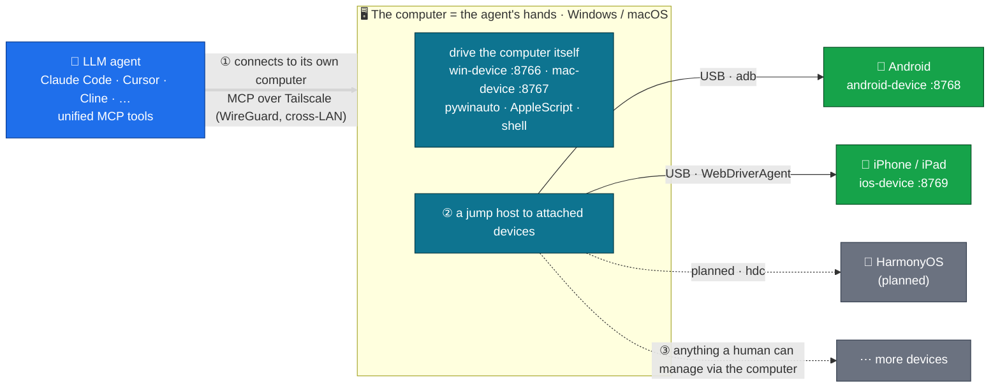

# Architecture



## Vision

`agent-fleet` 是一支被 LLM Agent 通过 MCP 直接驱动的**测试设备舰队**。Agent 坐在开发机上，可以像调用本地命令一样，操控 Windows PC、Mac、Android 手机、iOS 设备执行：

- 跑测试用例并读取结果
- 调试桌面/移动端 GUI
- 验证跨平台行为差异
- 自动化软件质量工作流

## 通用三段式架构

每个平台桥都是同样的三段式：

```
[Agent Host (Linux/Mac/anywhere)]  ── Tailscale ──>  [Device Host]  ── Native Drivers ──>  [Device / App]
            MCP Client                                MCP Server                            GUI / CLI / USB / ADB
```

### Segment 1 — 网络层：Tailscale

- 跨局域网、自动 NAT 穿透、MagicDNS 主机名
- 每台设备主机加入同一 tailnet
- Tailscale ACL 限定 Agent 主机才能访问设备主机

### Segment 2 — MCP Server（每台设备主机一个）

- 通过 streamable-http 暴露稳定的工具集
- 监听 `0.0.0.0:<platform_port>`；防火墙限制只有 Tailscale 接口可达
- 用户登录时自启（Task Scheduler / launchd / systemd）

### Segment 3 — 原生驱动（每平台不同）

<!-- gen:port-table -->
| 平台 | 设备主机 OS | 端口 |
|---|---|---|
| Windows 10/11 | Windows | 8766 |
| macOS | macOS | 8767 |
| Android | Windows / macOS / Linux | 8768 |
| iOS / iPadOS | macOS | 8769 |
| HarmonyOS（鸿蒙，规划中） | 任意 | 8770 |
<!-- /gen:port-table -->

端口预留按平台递增，避免一台主机同时跑多个桥时冲突（如 Mac 上同时跑 macOS 桥和 iOS 桥）。

另：`8765` 是 desktop-commander（社区通用 shell/file MCP）的端口，所有平台都可复用。

## 工具公约 (Universal Tool Set)

每个平台桥**必须实现下面的通用工具集**，工具名与语义保持一致。这样 Agent 切换设备时几乎不用换思维方式——只在 `~/.claude.json` 里换 server URL。

### Universal Tools

> **支持列**：`✓ all` = 四平台都实现；`desktop` = Windows + macOS；`mobile` = Android + iOS；`+ Android` 表示在 desktop 之外 Android 也实现。权威清单始终是 [`docs/internal/blueprint/INTERFACE.md`](internal/blueprint/INTERFACE.md)（自动生成）；下面这张表是人读的设计契约。

| 类别 | 工具 | 语义 | 支持平台 |
|---|---|---|---|
| 屏幕 | `get_screen_size()` | 返回 `{width, height}` | ✓ all |
| 屏幕 | `take_screenshot(region?)` | 返回 PNG bytes | ✓ all |
| UI 内省 | `dump_ui()` | 返回前台窗口 / 应用的 UI 树 | ✓ all |
| UI 内省 | `find_elements(query, ...)` | 按语义查 UI 元素，返回带中心坐标的候选列表 | ✓ all |
| UI 内省 | `tap_element(query, nth?)` | 找到元素并点其当前中心（element-first，抗布局漂移） | ✓ all |
| 触控 / 鼠标 | `tap(x, y, button?, clicks?)` | 屏幕坐标点击（touch 或 mouse，按平台） | ✓ all |
| 触控 / 鼠标 | `swipe(x1, y1, x2, y2, duration_ms?)` | 拖拽 / 滑动 | ✓ all |
| 触控（仅移动） | `long_press(x, y, duration_ms)` | 长按 | mobile（Android / iOS）|
| 键盘 | `type_text(text, interval?)` | 键入文本（Android 仅 ASCII；iOS / desktop 支持 Unicode） | ✓ all |
| 键盘 | `press_key(keys)` | 按键 / 组合键（移动端为物理按键如 `home`/`volume_up`；桌面为 `enter` / `cmd+s`） | ✓ all |
| 应用生命周期 | `launch_app(target, ...)` | 启动应用（target 平台语义不同：Win exe path / Android package / mac bundle / iOS bundle） | ✓ all |
| 应用生命周期 | `terminate_app(target)` | 终止应用 | ✓ all |
| 应用生命周期 | `current_app()` | 当前前台应用 | ✓ all |
| 设备生命周期 | `acquire` / `release` / `get_status` / `list_devices` / `set_default_device` / `get_default_device` | 设备资源租约 + 多设备路由 | ✓ all |

**桌面专属（仅 Windows / macOS）**——iOS 沙箱 / Android 受限，无完整对应：

| 类别 | 工具 | 语义 | 支持平台 |
|---|---|---|---|
| 鼠标 | `move_mouse(x, y, duration?)` | 移动指针 | desktop |
| 键盘 | `paste_text(text)` | 通过剪贴板贴入 Unicode | desktop |
| 进程 | `kill_process(pid)` | 按 PID 杀进程 | desktop |
| 进程 | `list_processes(name_filter?)` | 列运行中进程 | desktop |

**Shell 网关**（跨三平台，iOS 无）：

| 工具 | 语义 | 支持平台 |
|---|---|---|
| `run_shell(script, timeout?)` | 执行平台原生 shell（Windows PowerShell / macOS zsh / Android device shell） | Windows + macOS + Android |

iOS 完全沙箱无 shell 工具；移动端 shell 命令请用 mac-device 的 `run_shell`（如果要操作 host），或 android-device 的 `run_shell`（如果要操作设备）。

实现新平台桥时如果某个工具语义无法对应（例如 iOS 没有传统"窗口"概念），优先做语义映射（窗口 ≈ App + Scene），实在不能映射的工具留 stub 抛 `NotImplementedError`，并在该平台 README 里登记不支持。

### 平台扩展

| 平台 | 额外工具（实际代码） |
|---|---|
| Windows | `list_windows`, `inspect_window`, `focus_window`（pywinauto 窗口操作）+ `human_browser_open` + `browser_*`（共 27 个 playwright-mcp 嫁接，能力框架动态注入，不在 INTERFACE.md 静态清单） + 文件/搜索/进程一系列 desktop-commander 嫁接工具 |
| macOS | `run_applescript`（AppleScript 网关）+ `human_browser_open` + `browser_*`（同 Windows）+ 文件/搜索/进程一系列 desktop-commander 嫁接工具 |
| Android | `list_packages`, `push_file`, `pull_file`（PackageManager 与 adb push/pull）+ `upload_media`/`stage_upload`/`deliver_staged`/`job_status`/`get_upload_endpoint` 与 HTTP `POST /upload`（agent 自带字节传手机：落主机暂存→adb push→可选 install/媒体扫描）|
| iOS | `activate_app`, `device_info`, `list_apps`, `push_file_to_app`, `pull_file_from_app`（pymobiledevice3 + WDA 专属）+ `upload_to_photos`/`upload_to_app`/`get_upload_endpoint` 与 HTTP `POST /upload`（agent 自带字节传 iOS：target=photos 经自家 WDA 扩展 `/wda/photos/import` → PHPhotoLibrary 入相册；target=app 经 pymobiledevice3 afc 推 app 沙箱）|

扩展工具名必须与 Universal Tool Set 不冲突。建议用 `<platform>_<verb>` 前缀避免歧义。**完整运行时清单**：调 `list_capabilities()`（能力框架统一注入），它返回每个能力模块（含可选浏览器能力）的实际工具列表。

## 为什么是 Tailscale + MCP

| 需求 | 解决方案 |
|---|---|
| 跨局域网访问且不暴露公网端口 | Tailscale (WireGuard mesh) |
| 不维护 DNS 也能拿稳定主机名 | Tailscale MagicDNS |
| 细粒度访问控制（哪台设备能被谁连） | Tailscale ACL |
| LLM Agent 调用结构化工具 | MCP (streamable-HTTP) |
| 长连接、热加载工具列表 | MCP server 长驻进程 |

成本：Tailscale 免费档（100 设备以内）足够个人和中小团队使用。Linux/Mac/Windows 行为一致。

## 仓库布局

```
agent-fleet/
├── docs/                          # 跨平台文档
│   ├── architecture.md            # 本文件
│   ├── roadmap.md                 # 平台交付计划
│   └── platforms/                 # 各平台 setup guide
│       ├── windows.md
│       ├── macos.md
│       └── android.md
├── platforms/                     # 每平台一舱，自包含
│   ├── windows/
│   │   ├── README.md              # 平台快速上手
│   │   ├── server/                # MCP server 源码 + 依赖
│   │   ├── scripts/               # 安装脚本
│   │   └── examples/              # 参考配置
│   ├── macos/                     # 同样子结构
│   └── android/                   # 同样子结构
└── examples/                      # 跨平台示例
    └── multi-platform-claude-settings.json
```

加新平台时按 `platforms/<name>/` 目录树落入即可。

## 安全模型

按信任递减排列：

1. **Tailscale ACL** —— 只有 Agent 主机能连到设备主机（按 IP / tag 锁定）
2. **OS 防火墙** —— MCP 端口只允许 Tailscale 接口（Windows 上限定 `Tailscale` 网卡，macOS 上限定 `utun*`）
3. **MCP server bind** —— 设备本地 `0.0.0.0`，被防火墙限制范围
4. **Auth (规划中)** —— 每设备独立 bearer token；当前未实现，依赖 1–3 层

私有网络内此模型够用。公网部署需要额外的：
- 每调用鉴权
- 速率限制
- 审计日志

这些在 [`roadmap.md`](roadmap.md) v1.0.0 里跟进。
